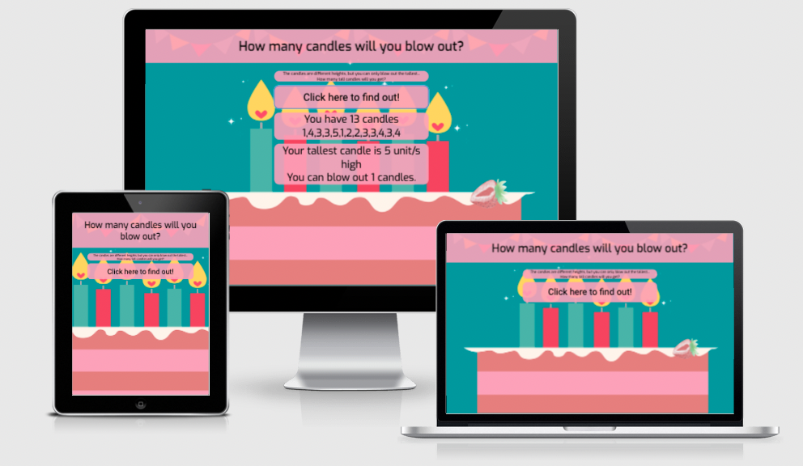
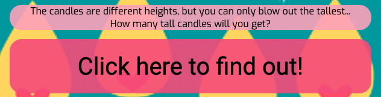
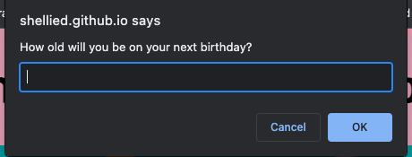
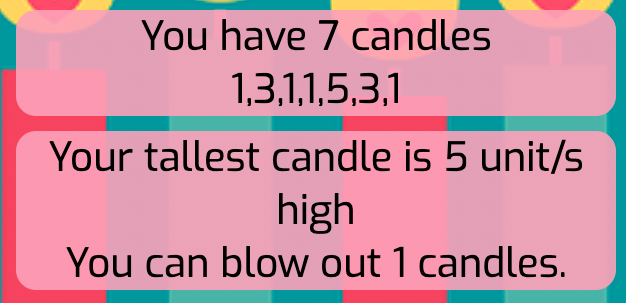
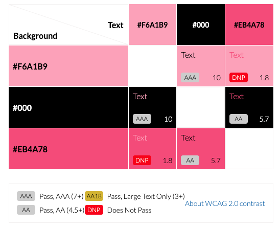
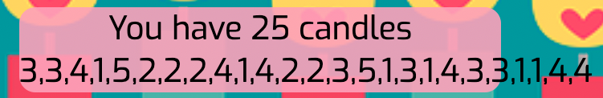
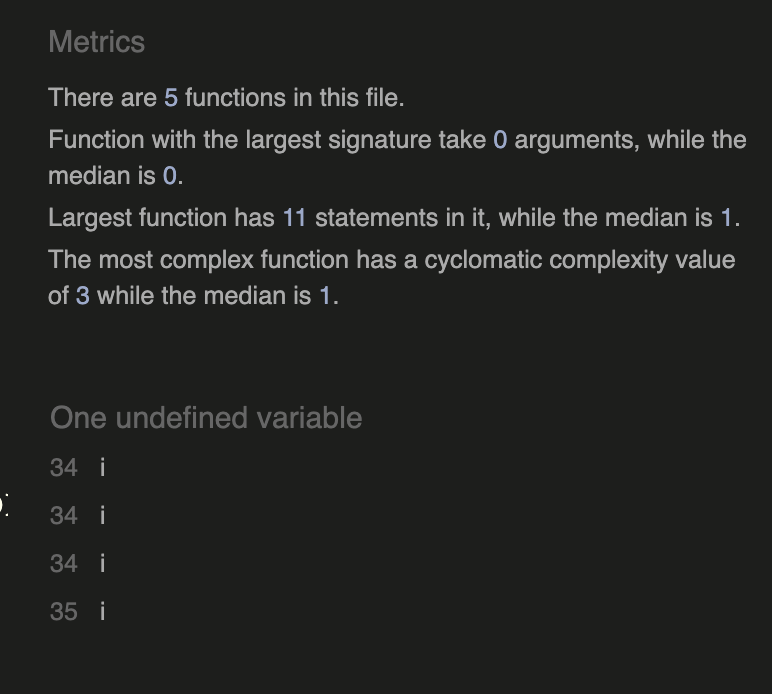
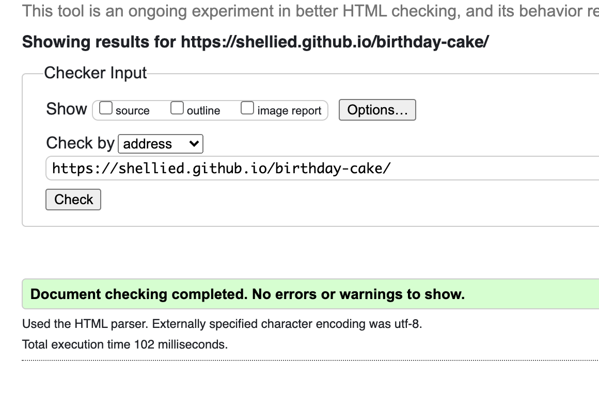
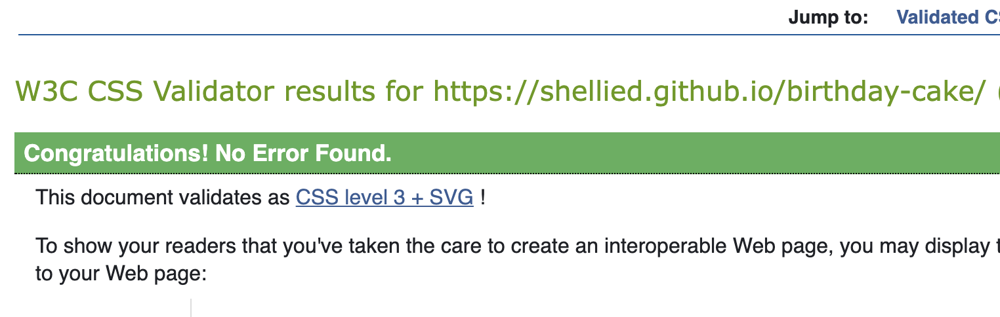
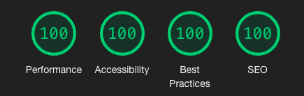

# Birthday Candles

This site has been designed in response to the below problem statement:

<i>'You are in charge of the cake for a child's birthday. You have decided the cake will have one candle for each year of their total age. They will only be able to blow out the tallest of the candles. Count how many candles are tallest.'</i>

Link to deployed site: [Birthday Cake](https://shellied.github.io/birthday-cake/)

## How to use the site.

As a user, you are presented with a one page site with a brief description of the information that will be presented.  

When you click the big button, a window prompt will appear and will ask you to enter your age at your next birthday.  The site will work it's magic, provide you with the correct amount of candles for your age (each candle will be between 1 and 5 units tall) and will calculate how many candles you can blow out - only the tallest!

 

## Design

### Imagery

The background image was sourced from [Pixabay](https://pixabay.com/?utm_source=link-attribution&amp;utm_medium=referral&amp;utm_campaign=image&amp;utm_content=6780746). Image by [Elf-Moondance](https://pixabay.com/users/elf-moondance-19728901/?utm_source=link-attribution&amp;utm_medium=referral&amp;utm_campaign=image&amp;utm_content=6780746).

 

### Typography

I used [Google Fonts](https://fonts.google.com/) to import the fonts 'Exo' and 'Roboto'.

 

### Colours

[imagecolorpicker.com](https://imagecolorpicker.com/en) was used to pick a matching colour for the background of the divs and black was used as a font-color.  I used EightShapes Contrast Grid to ensure that the text and background combinations used met the required contrast ratios in compliance with [WCAG 2.0 minimum contrast](https://www.w3.org/TR/UNDERSTANDING-WCAG20/visual-audio-contrast-contrast.html).

 

## Testing

Testing has taken place continously throughout the development of this site.  When creating the JavaScript, Console.logs were used regularly to ensure that expected outcomes were achieved and if the outcome produced was not as expected, debugging was undertaken at that point.  

Chrome Dev Tools was used to check how the HTML and CSS styles looked in the browser and this was regularly tweaked throughout the build.

### Resolved Issues

The code I initially used to create the candles[] would use produce the correct output, i.e an array the length of the age of the user with the maximum number being 5, however it would also produce 0 as a random number. 

`
let candles = Array.from({length: age}, () => Math.floor(Math.random() * 5));
`

To fix this, I simply added + 1 so that the minimum 'candle height' would be 1.

`
let candles = Array.from({length: age}, () => Math.floor(Math.random() * 5 + 1));
`

 

### Issues

* If you enter an age over 20, the candles array breaks out of the div and looks untidy.  However, as the problem statement suggests that this is for a child's birthday cake and taking into consideration the time constraints, this is something that will not be fixed for now. (screenshot below)

* This project has not been designed from a mobile-first perspective, so media queries will need to be impletemented for this to work effectively on a mobile phone.

### Validators

All code has been passed through the relevant validators and no errors have been found:

JShint

 

 

W3C HTML Validator

 

 

W3C CSS Validator

 

 

* The website was loaded into Wave to produce an accessibility report. No errors were found. The report can be found here: [Wave Accessibility Report](https://wave.webaim.org/report#/https://shellied.github.io/birthday-cake/)

* Lighthouse in Chrome Dev Tools was used to test the performance, accessibility, best practices and SEO scores and gave perfect scores:

## Deployment

This site was deployed to GitHub pages. The steps taken to deploy the site are as follows:

In the GitHub repository, select the settings menu
Choose the pages tab on the left hand side menu
From the source section drop-down menu, select the 'Main' branch
Once the page has automatically refreshed, the link to the successfully deployed page will be displayed.

## Technologies Used

* HTML
* CSS
* Javascript
* Gitpod
* Github
* Gitpages

## Reference Material

* [W3 Schools](https://www.w3schools.com/)
* [StackOverflow](https://stackoverflow.com/)
* [Google](https://www.google.co.uk/)
